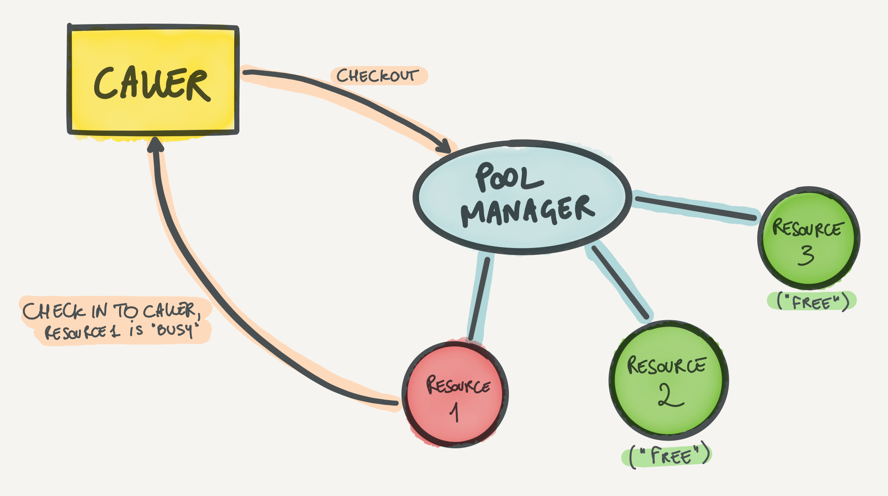
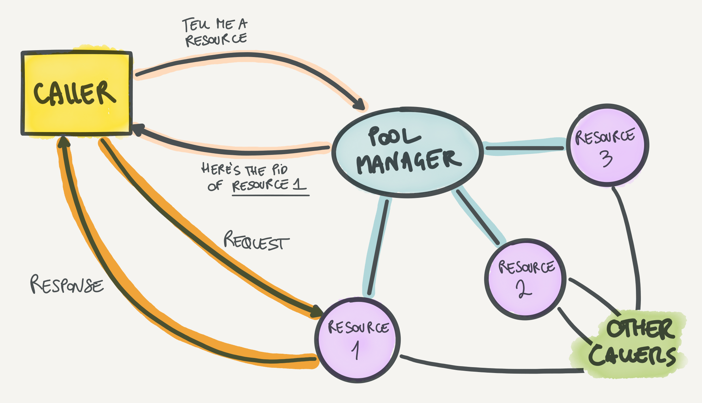
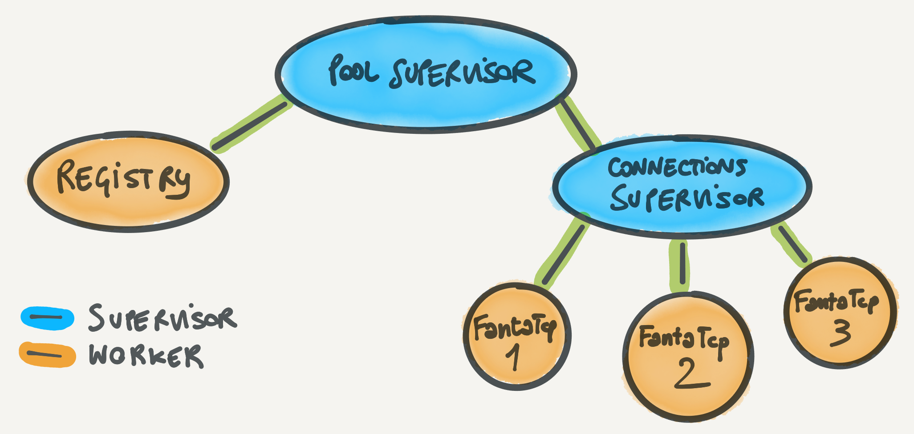

When you have a limited number of resources that you have to share for your all application, like database connections or worker processes, what you need is a *pool*. In this post, we're going to take a look at one possible pooling strategy that highly leverages Elixir's built-in [Registry][registry-docs] resulting in fast, reliable, and cleanly designed pools.

<!-- more -->


{{ unsplash_credit(name="Etienne Girardet", link="https://unsplash.com/@etiennegirardet?utm_source=unsplash&utm_medium=referral&utm_content=creditCopyText") }}

There are two most common pool kinds in Elixir: **checkout pools** and **routing pools**. I made up those names, but let's see what I mean.

## Checkout pools and routing pools

A **checkout pool** is a pool where resources are used *exclusively* by callers. What this means is that when a caller needs a resource from the pool, it will check the resource out of the pool and will be able to use it. While the resource is checked out, then the caller is the only process that is able to use the resource at that time. When the caller is finished with the resource, it can check it back in the pool for other processes to use.



Checkout pools are great for resources that can't be shared, like a TCP socket in passive mode, where only one process can call `:gen_tcp.recv/3` to receive data in a blocking way. They're also great for cases where sharing a resource doesn't really bring an advantage: for example, worker pools where a worker (the resource) can only do one thing at a time. However, checkout pools limit performance and utilization of resources that *can* be shared. An example that I really like for a good use case around checkout pools is HTTP/1 connections. Imagine you use a client like [Mint][mint], which behaves like a wrapper around a `:gen_tcp` or `:ssl` socket. HTTP/1 supports pipelining of requests (where you send multiple requests and await for multiple responses) but in practice it's rarely used. What clients usually do is send a request and await for the response before sending the next request. This is a natural case of "doing one thing at a time", as requests can't be parallelized. In this case a checkout pool works great because it allows to *move* the HTTP/1 connection (and socket) over to the process that makes the request. Doing so minimizes the message passing and copying of request and response data between the caller and the HTTP client.

A **routing pool** is a pool where resources can be shared by callers. In a routing pool, the pool only acts as a *router* to route the caller to the right resource, based on a variety of possible strategies (such as least used resource or round-robin). Resources are not checked out from the pool, so multiple callers can use the resource at the same time.



This pooling strategy leads to some advantages if the resource is shareable. Some examples of shareable resources are ETS tables or TCP connections where you want to use of multiplexing (to have multiple in-flight requests and responses). In contrast with the HTTP/1 example above, a great use case for routing pools is HTTP/2 connections. HTTP/2 supports *streams*, which are essentially requests. The difference with HTTP/1 requests is that you can have multiple streams in flight on the same connection. If you use a checkout pool for an HTTP/2 connection, then you won't be able to have multiple requests (streams) in flight from different callers and will not take advantage of this fundamental feature of the HTTP/2 design. With a routing pool, instead, you can have a pool of HTTP/2 connections and when you need to make a request the caller can be *routed* to one connection which will send the request. Multiple callers can be routed to the *same* connection before requests receive a response, since multiple requests can be in flight on the same connection.

Checkout pools tend to be more common in the Erlang and Elixir ecosystem. We have established libraries like [poolboy][poolboy] or [DBConnection][dbconnection] that implement checkout pools. However, routing pools tend to be hand rolled. In this post, we're going to take a look at how we can leverage [Registry][registry-docs] to build routing pools that can route using different strategies. Brace yourself!

## What we need before we go

Let's take a quick look at an example I came up with for a resource that we'll build a pool for, as well as at a small intro to what Registry is and how it works.

### Coming up with a resource to pool

The example we'll use to describe routing pools is a pool of GenServers that hold a TCP socket. These GenServers (let's call them `FantaTCP`) are able to send messages over TCP according to an imaginary serialization protocol (let's call it `Fantaprotocol`) and receive responses serialized through the same protocol. Requests have an ID so that responses for those requests can come in any order. This means that we can take advantage of a single TCP socket from multiple callers, but we can respond to callers as soon as we receive responses from the socket. Using one of these GenServers looks like this:

```elixir
FantaTCP.request(genserver_pid, "PING")
#=> {:ok, "PONG"}
```

The implementation for `FantaTCP` GenServers looks like this:

```elixir
defmodule FantaTCP do
  use GenServer

  def start_link({hostname, port}) do
    GenServer.start_link(__MODULE__, {hostname, port})
  end

  def request(pid, request) do
    GenServer.call(pid, {:request, request})
  end

  @impl true
  def init({hostname, port}) do
    case :gen_tcp.connect(hostname, port, []) do
      {:ok, socket} ->
        # "requests" is a map of request IDs to "from"s
        # (callers from handle_call/3). See handle_call/3.
        {:ok, {socket, _requests = %{}}}

      {:error, reason} ->
        {:stop, reason}
    end
  end

  def handle_call({:request, request}, from, {socket, requests}) do
    # We build the request ID.
    id = make_id()

    :ok = :gen_tcp.send(socket, Fantaprotocol.encode({id, request}))

    # We store the "from" under the request ID so we'll know
    # who to reply to. We don't reply right away so that we can
    # send other requests while the response for this request comes back.
    {:noreply, {socket, Map.put(requests, id, from)}}
  end

  # Let's pretend that "data" is always a complete response and can't
  # have less or more data than that.
  def handle_info({:tcp, socket, data}, {socket, requests}) do
    {id, response} = Fantaprotocol.decode(data)
    {from, requests} = Map.pop!(requests, id)
    GenServer.reply(from, {:ok, response})
    {:noreply, {socket, requests}}
  end
end
```

It's a bit of code, but the idea is that:

  * when we get a request, we encode it and send it through TCP, and then return without sending a response to the caller
  * while waiting for a response, the caller is blocked on the `GenServer.call/2`
  * when we get a response, we match it to the right caller and reply to that caller through `GenServer.reply/2`

With this in mind, we're ready to build our first pool of `FantaTCP`s.

### Registry 101

If you're not familiar with Registry, I'll give you a quick rundown. Registry is a key-value store tailored to registering PIDs under given keys. It's the same principle as when you call `Process.register(pid, :some_name)` to register a process under a name. To use it like `Process.register/2`, you can start it as a *unique* registry:

```elixir
pid = self()

Registry.start_link(name: FantaRegistry, keys: :unique)
Registry.register(FantaRegistry, :some_name, _value = nil)
Registry.lookup(FantaRegistry, :some_name)
#=> [{pid, nil}]
```

As you might have already noticed, you can even store an arbitrary value alongside a PID under a certain key. We'll make pretty cool uses of this later!

Another cool feature of Registry is that you can create a *duplicate* registry, that is, a registry that can store multiple PID-value pairs *under the same key*.

```elixir
Registry.start_link(name: FantaRegistry, keys: :duplicate)

# From a process with PID pid1 we call this:
Registry.register(FantaRegistry, :cool_processes, "cool process 1")

# From a process with PID pid2 we call this:
Registry.register(FantaRegistry, :cool_processes, "cool process 2")

# From whatever process:
Registry.lookup(FantaRegistry, :cool_processes)
#=> [{pid1, "cool process 1"}, {pid2, "cool process 2"}]
```

That's some cool stuff right there.

Since registries are smart bees, they monitor processes that are registered in them, so that if a process dies, then it will be removed from that registry.

Alright, we're ready to get pooling.

## Building a naive Registry-based routing pool

For our first naive pool, we're going to use Registry like we would use the built-in process registry (the one used by `Process.register/2`). We'll start a registry and pass it to the GenServers in the pool. Each GenServer will register itself in the registry. Let's start by looking at the changes needed in the `FantaTCP` GenServers.

```elixir
defmodule FantaTCP do
  use GenServer

  def start_link({hostname, port}) do
    GenServer.start_link(__MODULE__, {hostname, port})
  end

  @impl true
  def init({hostname, port}) do
    case :gen_tcp.connect(hostname, port, []) do
      {:ok, socket} ->
        Registry.register(FantaRegistry, :connections, _value = nil)
        {:ok, {socket, _requests = %{}}}

      {:error, reason} ->
        {:stop, reason}
    end
  end
end
```

When a `FantaTCP` GenServer starts up, it will register itself in the given registry under the `:connections` key. All the GenServers will register under that same key, so retrieving all the GenServers in the pool will be a matter of looking up that key in the registry.

```elixir
defmodule FantaPool do
  def start_link(hostname, port) do
    {:ok, _} = Registry.start_link(name: FantaRegistry, keys: :duplicate)

    for _ <- 1..10 do
      {:ok, _} = FantaTCP.start_link({hostname, port})
    end
  end

  def request(request) do
    # "connections" is a list of {pid, nil} tuples.
    connections = Registry.lookup(FantaRegistry, :connections)
    {pid, _value = nil} = Enum.random(connections)

    # Now we got "routed" to a connection to which we can send the request.
    FantaTCP.request(pid, request)
  end
end
```

Here we're using `Enum.random/1` to pick a connection from the ones registered in the registry, which means we'll do random routing. It tends to work well for many use cases since the load distribution is uniform over a decent number of requests, but we could potentially make things more complicated and use smarted strategies like round-robin.

### Supervising the pool and its connections

The `FantaPool` is a proper OTP disaster: no supervisors in sight. In this case, a single supervisor with the registry plus all the connections under it won't work. The reason is this: which supervision strategy would we pick? We want all connections to go down if the registry goes down since they become unreachable, so `:one_for_one` is a no-go. We don't want other connections to go down if a single connection goes down (so no `:rest_for_one`), but we also don't want *everything* to go down if anything goes down (so no `:one_for_all`). So, we have to go with more supervision layers: we'll have a `:rest_for_one` supervisor supervising the registry and a *connections' supervisor*. The connections' supervisor will be a `:one_for_one` supervisor that will supervise all the connections. Now go back on this paragraph and count all the variations of the word "supervisor": we're truly living the OTP life, aren't we?



Here's the code for the supervision tree above, with clarifying comments inline:

```elixir
defmodule FantaPool do
  use Supervisor

  def start_link({host, port}) do
    Supervisor.start_link(__MODULE__, {host, port})
  end

  @impl true
  def init({host, port}) do
    connections_specs =
      for index <- 1..10 do
        # Since all these children will live under the same supervisor,
        # they need to have different IDs. We overwrite the ID with
        # Supervisor.child_spec/2.
        Supervisor.child_spec({FantaTCP, {host, port}}, id: {FantaTCP, index})
      end

    # Here we build the child spec for another supervisor inline, without
    # having to define a new module.
    connections_supervisor_spec = %{
      id: :connections_supervisor,
      type: :supervisor,
      start: {Supervisor, :start_link, [connections_specs, [strategy: :one_for_one]]}
    }

    children = [
      {Registry, name: FantaRegistry, keys: :duplicate},
      connections_supervisor_spec
    ]

    Supervisor.init(children, strategy: :rest_for_one)
  end

  def request(request) do
    # Same as before, with random routing
  end
end
```

This code does already *a lot*. The registry monitors registered processes, so if a connection crashes, you don't get accidentally routed to it. That is, unless you catch the moment where the connection crashes, but the registry hasn't had time to deregister the connection yet, which is pretty rare.

## Improving our routing pool by accounting for disconnections

The implementation of pooling we just described works great for processes like the `FantaTCP` GenServer. However, most connection-like processes handle disconnections gracefully by going into a *disconnected* state. In this state, they reply with some kind of error to the caller and wait until they're reconnected (for example, to the TCP host) before accepting requests again. We can optimize our pool in these cases by *unregistering* a connection when it disconnects from the resource (TCP) and registering it again once it reconnects. Essentially, we can a registry where every connection registered under the `:connections` key is *connected*. This way, when we pick a random connection we'll most likely get one that's connected and that can handle our request.

```elixir
defmodule FantaTCP do
  use GenServer

  # ...

  @impl true
  def init({hostname, port}) do
    case :gen_tcp.connect(hostname, port, []) do
      {:ok, socket} ->
        Registry.register(FantaRegistry, :connections, _value = nil)
        {:ok, {socket, _requests = %{}}

      {:error, reason} ->
        {:stop, reason}
    end
  end

  @impl true
  def handle_info({:tcp_closed, socket}, {socket, _requests}) do
    Registry.unregister(FantaRegistry, :connections)

    # Let's imagine we can send a messaeg to ourselves to reconnect in 1
    # second, without actually implementing the handle_info/2 clause.
    Process.send_after(self(), :reconnect, 1000)

    {:noreply, {:nosocket, _requests = %{}}}
  end
end
```

There's a race condition to consider: if a connection disconnects, it might take a bit before it gets notified and unregisters itself. In that time frame, our callers might be routed to the disconnected connection. This is totally fine, because connections are prepared to return an error in case they can't send the request and get a response. However, with this strategy such cases happen in very short periods of time, so we can still see substantial benefits.

## Round-robin routing

Wow, we've been already through a lot. Hopefully at this point you had a glimpse of the potential of routing pools built on top of Registry. The last thing I want to sketch out is how you can build more "complex" routing strategies on top of what we built until now. We used the simplest routing strategy: choosing a resource at random. This requires no state and no coordination between callers of the pool. We'll look at how to build a pool that uses a round-robin routing strategy.

The **round-robin** strategy consists in going over the list of resources in the pool in order. The first caller gets the first resource, the second caller gets the second resource, and so on. Once callers got routed to all resources in the pool, they start over from the first one. To do this, a common strategy is to keep a shared index for the pool across all callers. When a caller needs a resource, it reads the index and then increments it (both operations are performed as an atomic transaction). The index is used as the index in the list of connections to the pool.

Our registry-based pools have the desirable property that callers don't need to talk to a centralized pool process to get resources from the pool, but can directly read the resources from the registry. To keep this property, we'll make the shared index readable and writable across callers. The simplest tool to do that in Erlang is ETS. Alongside the registry, our pool can spin up a process whose only job is to create an ETS table and keep it alive. The code for this "table owner" looks something like this.

```elixir
defmodule FantaTable do
  use GenServer

  def start_link(_opts) do
    GenServer.start_link(__MODULE__, [])
  end

  def init([]) do
    ets = :ets.new(__MODULE__, [:public, :named_table])
    # We start with -1 so that when we start incrementing the first value
    # will be 0.
    :ets.insert(__MODULE__, {:index, -1})
    {:ok, ets}
  end
end
```

Now, whenever a caller needs a resource, it can read plus increment the counter stored in the ETS table. The `:ets` module provides a useful function to do these operations atomically: `:ets.update_counter/3`. Let's add that as part of the API exposed by `FantaTable`.

```elixir
defmodule FantaTable do
  # ...

  def read_and_increment do
    :ets.update_counter(__MODULE__, _key = :index, _increment_by = 1)
  end
end
```

`:ets.update_counter/3` increments the counter under the given key by the given amount and returns the updated amount. We can now change the `FantaPool.request/1` function that we wrote above:

```elixir
def request(request) do
  # "connections" is a list of {pid, nil} tuples.
  connections = Registry.lookup(FantaRegistry, :connections)
  next_index = FantaTable.read_and_increment()

  # We get the connection in the list at the incremented index, modulo
  # the number of connections in the list (so that we wrap around).
  {pid, _value = nil} = Enum.at(connections, rem(next_index, length(connections)))

  # Now we got "routed" to a connection to which we can send the request.
  FantaTCP.request(pid, request)
end
```

There are two tiny issues with this implementation.

The first one is almost non-existent: we never reset the index in the ETS table. This means that if we do *a lot* of requests, we could potentially overflow the memory of the machine by making the index very big. In practice, if you do that many requests without restarting your node, you'll probably have other kinds of problems! It's a simple problem to fix though, since `:ets.update_counter/4` exists. This variant of the `updated_counter` function lets you specify a *threshold* after which the counter should reset to a given value. That way, you can reset the counter to `0` after you reach a high enough number.

The second problem is only a problem if we really stick with the definition of round-robin. Since the number of resources in our pool can vary, it might be that we have `10` resources in the pool when we do one request but then the first two resources disconnect. Now we have `8` resources in the pool. A caller might get the fifth resource when there's `10` resources in the pool, but if the next caller asks for the sixth resource *after* the first two resources disconnected, it's actually going to skip two resources and jump to the eighth resource in the original list. There are other ways to implement stricter round-robin where every resource is hit exactly once before the next one, but in practice this algorithm works fine for most use cases since often resources stay connected most of the time.

## Conclusion

Oooph. This post was a **large** one. We went over the basics of pools and the two most common kinds of pools used in the Erlang and Elixir landscape, that is, checkout pools and routing pools. Then, we set some context by describing the common use cases for a pool, with a focus on where routing pools shine and a look at a sample resource to pool (our `FantaTCP` GenServer). After that, we had a first look at how to use Elixir's built-in Registry module to build a naive routing pool that routes randomly to connections in the pool. We then improved this pool by adding logic to handle disconnections and reconnections of resources in the pool. Finally, we looked at a "smarter" routing strategy, round-robin, and how to implement that on top of our pool with the help of some hand-rolled ETS moves.

Hopefully, this post gave you an idea of how to build this kind of pools as well as help you understand the distinction between checkout pools and routing pools (and when to use one or the other). In my experience, building pools is not a day-to-day activity, but I had the need to build something like what I described here a few times, so it's not an extremely rare thing to do either.

If you build something cool from this article, you're welcome to share it with me. Now let's get pooling!

[registry-docs]: https://hexdocs.pm/elixir/Registry.html
[mint]: https://github.com/elixir-mint/mint
[poolboy]: https://github.com/devinus/poolboy
[dbconnection]: https://github.com/elixir-ecto/db_connection
