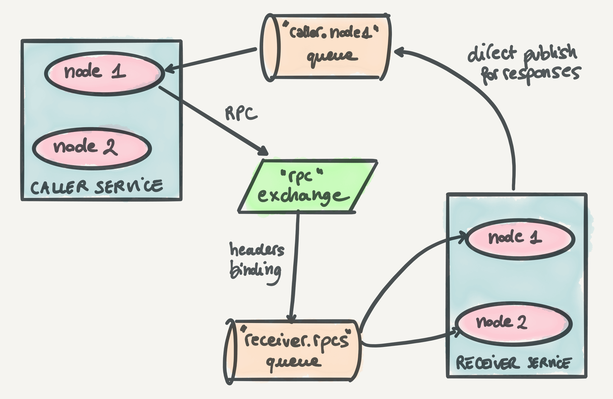
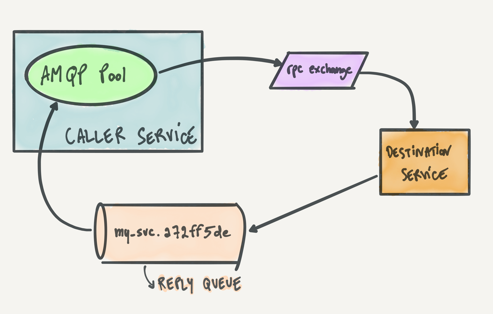
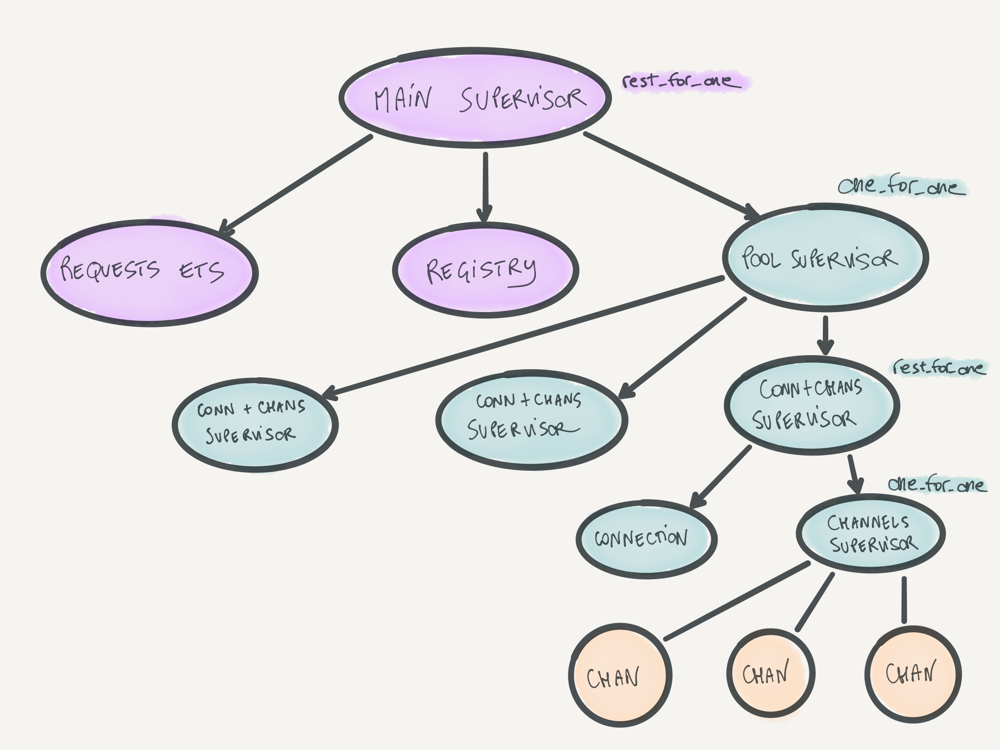
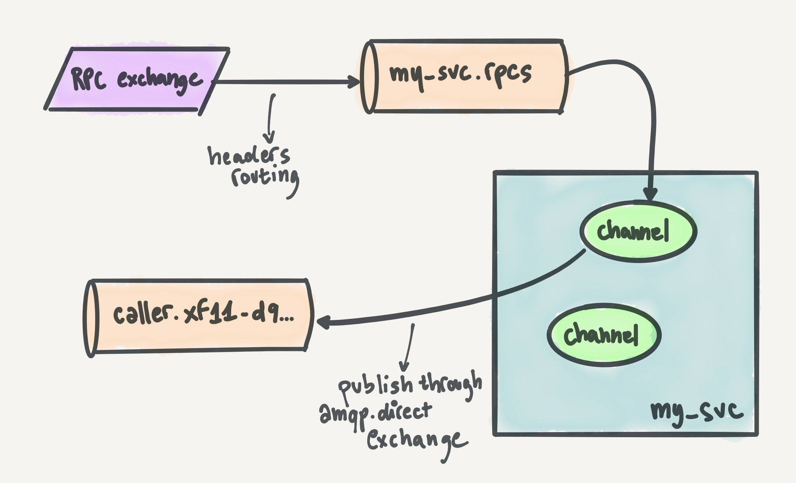

At [Community][community], we use [RabbitMQ][rabbitmq], a lot. It's the infrastructure backbone that allows our services (over forty at this point) to communicate with each other. That mostly happens through **events** (since we have an event-sourced system), but in some cases what we need is a *request-response* interaction between two services. This is the best tool in a few use cases, like retrieving data on the fly or asking a service to do something and return a response. An industry standard for such interactions is HTTP, but we are not big fans of that. Instead, since RabbitMQ is so ubiquitous in our system, we settled on using it for request-response interactions as well in the form of **Remote Procedure Calls** (RPCs). In this post, I'll go over the architecture of such interactions. I'll talk about the RabbitMQ topologies we use to make them work, the benefits around reliability, the compromises around performance, and finally how this all implemented to be as fault-tolerant as possible with Elixir.

<!-- more -->


{{ unsplash_credit(name="amandazi photography", link="https://unsplash.com/@amandazi_photography?utm_source=unsplash&utm_medium=referral&utm_content=creditCopyText") }}

## What is an RPC

An RPC can be seen as a function call across system boundaries, instead of at the code execution level. An RPC allows you to call a *procedure* on another service and treat it mostly like a local function call (with the additional error handling to account for the network interaction).


I won't go into too much detail about RPCs themselves, but you're probably familiar with a common form of RPC: HTTP. HTTP request-response interactions between services in a service-oriented architecture are essentially RPCs, they're just less explicit on the fact that they're *calling a procedure*. One of the benefits of RPCs is, like HTTP, that they are agnostic of technologies. A services written in Elixir can make an RPC (or HTTP request) to a service written in Go, for example. If you want to read more about RPCs, their definition, their benefits, and more, guess where I'll link you to? Exactly, [Wikipedia][wikipedia-rpc].

Throughout this post, I will refer to the services involved in an RPC as the **caller service** and the **receiver service**.

## Why RPCs over RabbitMQ

At Community, we chose to do RPCs over RabbitMQ, instead of the common service-to-service communication via HTTP, for a few reasons.

The main reason is that we want to use message queues as often as possible. When you have a queue-based message broker between services that talk to each other, the availability requirements of the services can be less demanding. If you have two services that communicate over HTTP, then if the receiver service is down it means that the requester service will not get a response. Instead, the requester service will have to implement request retries in order to increase the chances of a successful request. With RabbitMQ in the middle, if the receiver is down then the RPC is queued and can be picked up once the receiver comes back up.

Another important reason that influenced our decision is that we make heavy use of RabbitMQ for all sorts of things. This means our engineer know it well, our infrastructure is solid, and we have good systems to trace and observe messages flowing through it.

One compromise we had to make is that, generally speaking, RPCs over RabbitMQ tend to be *slower* than direct service-to-service communication (such as HTTP). This is hard to avoid given that in our case we have a message broker sitting between the caller service and the receiver service. That means that you'll *at least* have twice the RTT (round-trip time) on the network, since the messages you're sending and receiving need to jump through one more hop than if you do direct service-to-service communication. However, when we do RPCs the bottleneck is rarely the network or the message broker, and instead tends to be the processing of the RPC itself. So, we're fine with the compromise here.

## RabbitMQ topology

Let's talk about the **RabbitMQ topology** that powers our RPC system. We have the following components in place:

  * A *headers* exchange called `rpc`. Caller services publish RPCs to this exchange with two headers, `destination` (the receiver service name) and `procedure` (the procedure name).

  * Per-service queues where RPCs end up. Their name usually looks like `receiver_service.rpcs`. Multiple *instances* (nodes) of the same service share a single queue. All the running instances of the receiver service consume from this queue.

  * A binding between each per-service queue and the `rpc` exchange. Since `rpc` is a headers exchange, the binding happens on the headers. Most commonly, receiver services bind their queue to the `rpc` exchange on the `destination: receiver_service_name` header, but sometimes we can be more flexible and specific by also using the `procedure` header.

  * A per-instance *response queue* where responses to RPCs are published by the receiver service. Each *instance* of the caller service consumes from its dedicated response queue.

Below is an artistic representation of the RabbitMQ topology. This one is for you, my visual friends.



## Caller architecture

Our focus when designing this architecture *was not* performance. Since our system is event-sourced, when services need to access data *fast*, we usually have alternatives to RPCs. In those cases, instead of fetching data from another service via RPC, a service can usually build a "local" data store (usually Redis, but whatever fits best) by consuming events and have fast access to that data store. However, this doesn't cover use cases where a service wants to ask another service to do something and return a result. This can be usually also be done via asynchronous events, but sometimes it really can't and in any case we like the agility of RPCs for when we're moving fast and don't want to commit to particular data exchanges in the long term.

Instead, we heavily focused on reliability and resource utilization. We want our RPCs to succeed whenever they can. We also want to limit RabbitMQ resource utilization as much as possible, since the message broker architecture shares the broker between all the services that use it.

With these goals in mind, we came up with the topology described above. In the sketch below, I'm focusing on the caller service perspective.



This is what happens, step by step, when a service makes an RPC:

  * The caller assigns a new UUID to the request and encodes the request (we happen to use Protobuf, but anything would work).

  * The caller includes the name of the *response queue* in the `reply_to` metadata field of the RabbitMQ message.

  * The caller publishes the request on the main RPC exchange (`rpc`) using headers to specify the `destination` and `procedure` to call.

  * If publishing the request is successful, the caller stores the request in an in-memory key-value store (ETS for Elixir and Erlang folks), storing the mapping from request ID to caller process. This is used to map responses back to requests when they come back.

  * The caller has a pool of AMQP channels also consuming from the response queue. When the response comes back on such queue, a consumer channel picks it up, finds the corresponding caller process from the in-memory key-value store, and hands the caller process the response.

From a code standpoint, an RPC really does look like a function call. The main difference is that an RPC can *definitely* fail due to the network interaction, so we always make sure to return a successful value or an error value. In Elixir, that translates to `{:ok, response}` or `{:error, reason}` tuples. In a typed language (say Haskell) it would be the "either" type. This is what an RPC looks like from the caller side (in Elixir-flavored pseudocode):

```elixir
case RPCPool.call("my_receiver_svc", "add", %{"args" => [4, 9]}) do
  {:ok, %{"result" => result}} ->
    result #=> 13

  {:error, reason} ->
    raise "failed because: #{inspect(reason)}" #=> such as :timeout
end
```

### The response queue

It's worth focusing on the **response queue**. All AMQP channels in the caller pool declare this queue when they start up. This is a common pattern in RabbitMQ since declaring resources (queues, exchanges, and bindings) is *idempotent*, that is, you can do it as many times as you want with the resource being declared only once.

The response queue is declared with a key property: `auto_delete`. When this property is present, RabbitMQ deletes the queue as soon as there are no channels consuming from it anymore. This is exactly the behavior we want: as long as a caller pool is "up and running", there's going to be at least one channel consuming from the queue and handing responses over to caller processes. However, if the whole pool or the whole node for the caller goes down then the queue will be deleted. This works perfectly, because if the caller node goes down, then we likely lost the "context" of the requests, and even if the node will come back up then it won't know what to do with the responses anymore. As [one RabbitMQ documentation page][rabbitmq-direct-reply-to] puts it:

> Reply messages sent using \[RPC\] are in general not fault-tolerant; they will be discarded if the client that published the original request subsequently disconnects. The assumption is that an RPC client will reconnect and submit another request in this case.

In this way, we allow RabbitMQ to clean itself up and avoid leaving garbage in it, without writing any code to do so.

The code for each AMQP channel that consumes responses goes something like this:

```elixir
channel = AMQP.Channel.open(amqp_connection)

# "response_queue" is determined per-pool.
# Usually it looks like: "caller_service.#{UUID.generate()}"
AMQP.Queue.declare(channel, response_queue, auto_delete: true)

AMQP.Basic.consume(channel, response_queue)
```

When a response comes back, the caller does a key lookup on the response's request ID in the in-memory key-value data store to retrieve the original request and moreover the process that's waiting on the response. It looks like this:

```elixir
def handle_rabbitmq_message(message) do
  response = decode!(message)
  caller_process = KVStore.fetch(response.request_id)
  send(caller_process, response)
end
```

### Elixir process architecture

The Elixir process architecture and supervision tree structure we use for the caller is based on the properties of the response queue described above. We have the following constraints:

  * If the in-memory key-value store that holds the mappings between request IDs and caller processes (ETS) crashes, we want the whole pool to crash. We wouldn't be able to map responses back to requests in any case at that point, and it's better to let RabbitMQ delete the whole response queue in such cases.

  * If a connection or a channel goes down, we don't want to delete the response queue. As long as there's at least one channel consuming from the response queue, we'll be able to hand responses back to the corresponding caller processes.

With these constraints, we designed this supervision tree:



It's pretty deep and nested, but a lot of it is dancing to use the right supervision strategies. We have a main supervisor for the whole caller architecture. Then, we have a pool supervisor that supervises the connections and channels. That supervisor's children are supervisors that each look over one AMQP connection and one "channel supervisor". The channel supervisor supervises AMQP channels. That was hard to type, but hopefully it makes sense?

I won't go into detail here, but the point of this design is that if anything in that supervisor fails, the failures bubble up and cascade correctly. If there's really nothing more fun that you could do (I hardly believe that), play "kill the process" in your head and see what happens when you kill any process above. It's fun, if this sort of stuff is fun for you (which is a tautology).

The registry shown in the diagram is an Elixir `Registry` that all AMQP channels register themselves to. This allows us to access AMQP channels fast, without going through a single pool process. I talked more about Registry-based process pools in Elixir in [another blog post][process-pools-with-registry-post].

All the code in there is build on top of the [AMQP][amqp-library] Elixir library.

## Receiver architecture and topology

The receiver architecture, compared to the caller, is straightforward. Every service sets up a pool of RabbitMQ connections (and channels), declares a queue, and binds it to the main RPC exchange (`rpc`). That exchange is a *headers* exchange, and each service usually binds the queue with the `destination` header matching that service. For example, here's the pseudocode for the `receiver_svc` service:

```elixir
AMQP.Queue.declare(channel, "receiver_svc.rpcs", durable: true)

AMQP.Queue.bind(
  channel,
  "receiver_svc.rpcs",
  exchange: "rpc",
  headers: [{"destination", "receiver_svc"}]
)

AMQP.Basic.consume(channel, "receiver_svc.rpcs")
```

All AMQP channels over all nodes of the receiver service declare the queue and bind it *on every startup*. Idempotency, friends!

From here, it's all downhill: when a request comes in on a channel, the node decodes it, processes it, produces a response, and publishes it back on RabbitMQ. Where does it publish it? Well, good question. That's why all requests have the `reply_to` RabbitMQ metadata field set to the reply queue of the caller. We take advantage of the default `amqp.direct` exchange, which is pre-declared by all RabbitMQ nodes, to publish the response directly to the reply queue. The pseudocode to handle a request is this:

```elixir
response = process_request(request)

AMQP.Basic.publish(
  exchange: "amqp.direct",
  routing_key: request.metadata["reply_to"]
)
```

Below is a nice artsy drawing focusing on the RabbitMQ topology and interactions of the receiver service.



### In Elixir, as always, the answer is Broadway

As far as Elixir specifics goes, we use [Broadway][broadway] to consume RPCs, hooking it up with the [`broadway_rabbitmq`][broadway_rabbitmq] producer.

I personally made enough changes to `broadway_rabbitmq` by now that, look at that, it perfectly fits our use case! This is how a typical Broadway pipeline to consume RPCs looks like in our services:

```elixir
defmodule MyService.RPCConsumer do
  use Broadway

  def start_link([]) do
    broadway_rabbitmq_options = [
      queue: "my_service.rpcs",
      declare: [durable: true],
      bindings: [
        {"rpc", arguments: [{"destination", :longstr, "my_service"}]}
      ],
      metadata: [:reply_to]
    ]

    Broadway.start_link(__MODULE__,
      name: __MODULE__,
      producer: {BroadwayRabbitMQ.Producer, broadway_rabbitmq_options},
      processors: [default: [concurrency: 10]]
    )
  end

  def handle_message(_, %Broadway.Message{} = message, _context) do
    response =
      request
      |> decode_request!()
      |> process_request()
      |> encode_response!()

    # This is where we publish the response.
    AMQP.Basic.publish(
      message.metadata.amqp_channel,
      exchange: "amqp.direct",
      routing_key: message.metadata.reply_to,
      payload: response
    )

    message
  end
end
```

As you can see, `broadway_rabbitmq` exposes the AMQP channel it uses to consume under the hood in the message metadata. We use that to send replies. Easy-peasy.

Small disclaimer: we have a wrapper library around Broadway that makes this slightly boilerplate-y code a bit simpler and more tailored to our use case. It also provides us with some nice additions such as round-robin connection attempts over a list of RabbitMQ URLs (for reliability), automatic decoding of requests (so that the decoding is done under the hood), metrics, error reporting, and so on. However, the gist of it is exactly the code above.

## Conclusion

We saw how we architected a system to make service-to-service RPCs over RabbitMQ. Then, we went over the RabbitMQ topology we use, showing all the queues, exchanges, and bindings involved. Finally, we also covered the Elixir-specific implementation of this system, to sprinkle some practical examples on top of this stuff.

Here's some more resources on RPCs over RabbitMQ:

  * [RabbitMQ's tutorial][rabbitmq-rpc-python-tutorial] shows a nice step-by-step implementation of RPCs over RabbitMQ using the Python client. It's a bit less complex than our architecture since the response queue doesn't get deleted when the caller stops, but it can still go a long way. They do make it clear that this is not a totally production-ready solution.

  * [RabbitMQ's "direct reply-to" documentation][rabbitmq-direct-reply-to], which shows an alternative way to do RPCs over RabbitMQ that's built-in into RabbitMQ. This solution is simpler than ours as it doesn't allow multiple consumers to get messages from a shared *response queue*, but it's pretty cool. I learned about it while writing this blog post.

  * [A nice blog post][medium-blog-post] about RPC over RabbitMQ. Lots of Python code to look at.

## Acknowledgements

I need to thank my coworker and friend Tom Patterer, who designed and implemented the system with me and helps me maintain it while our architecture and needs to keep growing. I also need to thank [José][jose] because he pushed me to write this blog post when I chatted with him about all of this.

[community]: https://www.community.com
[jose]: https://twitter.com/josevalim
[broadway]: https://github.com/dashbitco/broadway
[broadway_rabbitmq]: https://github.com/dashbitco/broadway_rabbitmq
[amqp-library]: https://github.com/pma/amqp
[process-pools-with-registry-post]: https://andrealeopardi.com/posts/process-pools-with-elixirs-registry
[wikipedia-rpc]: https://en.wikipedia.org/wiki/Remote_procedure_call
[rabbitmq-rpc-python-tutorial]: https://www.rabbitmq.com/tutorials/tutorial-six-python.html
[rabbitmq-direct-reply-to]: https://www.rabbitmq.com/direct-reply-to.html
[medium-blog-post]: https://medium.com/swlh/scalable-microservice-architecture-using-rabbitmq-rpc-d07fa8faac32
[rabbitmq]: https://www.rabbitmq.com
