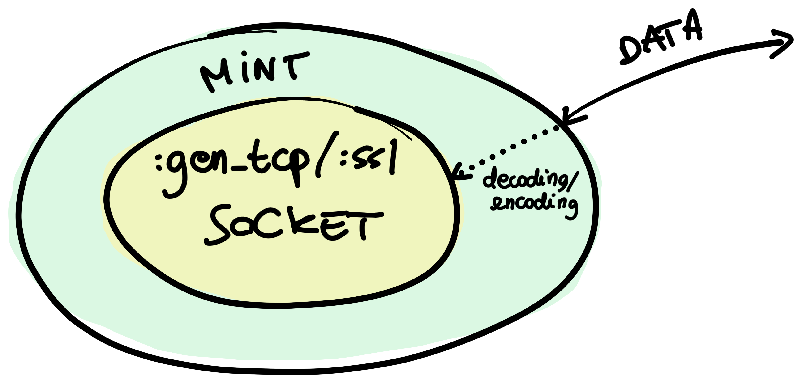

Elixir's ecosystem has quite a few **HTTP clients** at this point. But what's
the *best one*? In this post, I want to break down a bunch of the clients we
have available. I'll give an overview of the clients I personally like the most,
and I'll talk about which clients are the best choice in different use cases.
I'll also share some advice with library authors.

<!-- more -->


<span class="image-caption">This is AI generated, just to be clear</span>

## All Your Clients Are Belong to Us

So, let's take a whirlwind tour of some HTTP clients available in Elixir. We'll
talk about these:

  * [Mint](#mint)
  * [Finch](#finch)
  * [Req](#req)
  * [httpc](#httpc)

This is not a comprehensive list of all the Elixir HTTP clients, but rather a
list of clients that I think make sense in different situation. At the end of
this post, you'll also find a mention of other well-known clients, as well as
advice for library authors.

### Mint

Let's start with [Mint][mint]. Mint is arguably the lowest-level HTTP client
we've got in Elixir. It's essentially a *wrapper* around a raw TCP or SSL
socket. Its job is to make the socket **aware of the network protocol**. It's
stateless, meaning that all you deal with is a "connection" data structure, and
it's process-less, meaning that it doesn't impose any process architecture on
you.

Think about a `:gen_tcp` or a `:ssl` socket. Their job is to allow you to
connect servers and clients on the TCP and TLS network protocols, respectively.
When you're using one of these directly, you usually have to do most of the
encoding of decoding of the data that you're sending or receiving, because the
sockets carry just binary data.

Mint introduces an abstraction layer *around* raw sockets, rather than *on top*
of them. Here's a visual representation:



When you use Mint, you have an API that is similar to the one provided by the
`:gen_tcp` and `:ssl` modules, and you're using a socket underneath. Mint
provides a *data structure* that it calls a **connection**, which wraps the
underlying socket. A Mint connection is aware of the HTTP protocol, so you don't
send and receive raw binary data here, but rather data that makes sense in the
semantics of HTTP.

For example, let's see how you'd make a request using Mint. First, you'd want to
open a connection. Mint itself is **stateless**, and it stores all the
connection information inside the connection data structure itself.

```elixir
{:ok, conn} = Mint.HTTP.connect(:http, "httpbin.org", 80)
```

Then, you'd use [`Mint.HTTP.request/5`][docs-mint-http-request] to send a
request.

```elixir
{:ok, conn, request_ref} = Mint.HTTP.request(conn, "GET", "/", [], "")
```

Sending a request is analogous to sending raw binary data on a `:gen_tcp` or
`:ssl` socket: it's *not blocking*. The call to `request/5` returns right away,
giving you a **request reference** back. The underlying socket will eventually
receive a response as an Erlang message. At that point, you can use
`Mint.HTTP.stream/2` to turn that message into something that makes sense in
HTTP.

```elixir
receive do
  message ->
    {:ok, conn, responses} = Mint.HTTP.stream(conn, message)
    IO.inspect(responses)
end
#=> [
#=>   {:status, #Reference<...>, 200},
#=>   {:headers, #Reference<...>, [{"connection", "keep-alive"}, ...},
#=>   {:data, #Reference<...>, "<!DOCTYPE html>..."},
#=>   {:done, #Reference<...>}
#=> ]
```

Mint supports HTTP/1.1 and HTTP/2 out of the box, as well as WebSocket through
[mint_web_socket].

#### When to Use Mint

Generally, ***don't use Mint***. Seriously. You know I mean this advice, because
I'm one of the [two][gh-whatyouhide] [people][gh-ericmj] who maintain and
originally created Mint itself! For most use cases, Mint is too low
level. When you use it, you'll have to care about things such as pooling
connections, process architecture, keeping the connection structs around, and so
on. It's a bit like what you'd do in other cases, after all. For example, you're
unlikely to use `:gen_tcp` to communicate directly with your PostgreSQL
database. Instead, you'd probably reach *at least* for something like
[Postgrex][postgrex] to abstract a lot of the complexity away.

Still, there are some use cases where Mint can make a lot of sense. First and
foremost, you can use it to build higher-level abstractions. That's exactly what
a library called Finch does, which we'll talk about in a bit. Mint can also be
useful in cases where you need fine-grained control over the performance and
process architecture of your application. For example, say you have a fine-tuned
[GenStage][gen_stage] pipeline where you need to make some HTTP calls at some
point. GenStage stages are already processes, so having an HTTP client based on
a process might introduce an unnecessary layer of processes in your application.
Mint being processless solves exactly that.


A few years ago, I worked at a company where we would've likely used Mint in
exactly this way. At the time, I wrote [a blog
post][forza-football-gen_stage-post] that goes into more detail in case you're
interested.

#### Bonus: Why Isn't Mint in the Elixir Standard Library?

That's a great question! When we introduced Mint back in 2019, we [posted about
it][mint-blog-post] on Elixir's website. Our original intention was to ship Mint
with Elixir's standard library. This is also one of the reasons why we wrote
Mint in Elixir, instead of Erlang. However, we then realized that it worked well
as a standalone library, and including it into the standard library would
increase the cost of maintaining the language as well as potentially slow down
the development of Mint itself.

That said, I think of Mint as the "standard-library HTTP client", that is, the
low-level client that you'd expect in the standard library of a language like
Elixir.

### Finch

[Finch][finch] is a client built on top of Mint. It serves an important job in
the "pyramid of abstractions" of HTTP clients listed in this post: **pooling**.
Finch provides pooling for Mint connections. Using Mint on its own means
implementing some sort of strategy to store and pool connections, which is what
Finch provides.

Finch is quite smart about its pooling. It uses [nimble_pool] when pooling
HTTP/1.1 connections. The nimble_pool library is a tiny resource-pool
implementation heavily focused on a small resource-usage footprint as well as on
performance. Since HTTP/2 works quite differently from HTTP/1.1 and the former
is capable of multiplexing requests, Finch uses a completely different strategy
for HTTP/2, without any pooling. All of this is transparent to users.

The API that Finch provides is still quite low-level, with manual request
building and such:

```elixir
{:ok, _} = Finch.start_link(name: MyFinch)

Finch.build(:get, "https://hex.pm") |> Finch.request(MyFinch)
#=> {:ok, %Finch.Response{...}}
```

However, but the convenience of pooling and reconnections that Finch provides is
fantastic.

Okay, when to use Finch then? Personally, I think Finch is a fantastic library
whenever you have performance-sensitive applications where you're ready to
sacrifice some of the convenience provided by "higher-level" clients. It's also
great when you know you'll have to make a lot of requests to the same host,
since you can specify dedicated connection pools per host. This is especially
useful when communicating across internal services, or talking to third-party
APIs.

### Req

[Req][req] is a relatively-new kid on the block when it comes to HTTP clients in
Elixir. It's one of my favorite Elixir libraries out there.

```elixir
Req.get!("https://api.github.com/repos/wojtekmach/req").body["description"]
#=> "Req is a batteries-included HTTP client for Elixir."
```

It's built on top of Finch, and it takes a quite "functional-programming"
approach to HTTP. What I mean by that is that Req revolves around a
[`Req.Request`][req-request-docs] *data structure*, which you manipulate to add
options, callbacks, headers, and more before making an HTTP request.

```elixir
req =
  Req.Request.new(method: :get, url: "https://github.com/...")
  |> Req.Request.append_request_steps(
    put_user_agent: &Req.Steps.put_user_agent/1
  )
  |> Req.Request.append_response_steps(
    decompress_body: &Req.Steps.decompress_body/1,
    decode_body: &Req.Steps.decode_body/1
  )
  |> Req.Request.append_error_steps(retry: &Req.Steps.retry/1)

{req, resp} = Req.Request.run_request(req)
```

Req is extensively customizable, since you can [write
plugins][req-request-docs-plugins] for it in order to build HTTP clients that
are tailored to your application.

#### When To Use Req

First and foremost, Req is *fantastic* for scripting. With the introduction of
[`Mix.install/2`][docs-mix-install] in Elixir 1.12, using libraries in Elixir
scripts is a breeze, and Req fits like a glove.

```elixir
Mix.install([
  {:req, "~> 0.3.0"}
])

Req.get!("https://andrealeopardi.com").headers
#=> [
#=>   {"connection", "keep-alive"},
#=>   ...
#=> ]
```

Req is also a great fit to use in your applications. It provides a ton of
features and plugins to use for things like encoding and decoding request
bodies, instrumentation, authentication, and so much more. I'll take a quote
straight from Finch's README here:

> Most developers will most likely prefer to use the fabulous HTTP client
> [Req][req] which takes advantage of Finch's pooling and provides an extremely
> friendly and pleasant to use API.

So, yeah. In your applications, unless you have some of the needs that we
described so far, just go with Req.

### httpc

While Mint is the lowest-level HTTP client I know of, there's another client
worth mentioning alongside it: [`httpc`][httpc]. `httpc` ships with the Erlang
standard library, making it the **only** HTTP client in the ecosystem that
*doesn't require any additional dependencies*. This is so appealing! There are
cases where not having dependencies is a huge bonus. For example, if you're a
library author, being able to make HTTP requests without having to bring in
additional dependencies can be great, because those additional dependencies
would trickle down (as transitive dependencies) to all users of your library.

However, `httpc` has major drawbacks. One of them is that it provides little
control over connection pooling. This is usually fine in cases where you need a
few one-off HTTP requests or where your throughput needs are low, but it can be
problematic if you need to make a lot of HTTP requests. Another drawback is that
its API is, how to put it, *awkward*.

```elixir
{:ok, {{version, 200, reason_phrase}, headers, body}} =
  :httpc.request(:get, {~c"http://www.erlang.org", []}, [], [])
```

The API is quite low level in some aspects, since it can make it hard to compose
functionality and requires you to write custom code for common functionality
such as authentication, compression, instrumentation, and so on.

That said, the main drawback of `httpc` in my opinion is *security*. While all
HTTP clients on the BEAM use [`ssl`][docs-ssl] sockets under the hood (when
using TLS), some are much better at providing **secure defaults**.

```elixir
iex> :httpc.request(:get, {~c"https://wrong.host.badssl.com", []}, [], [])

09:01:35.967 [warning] Description: ~c"Server authenticity is not verified since certificate path validation is not enabled"
     Reason: ~c"The option {verify, verify_peer} and one of the options 'cacertfile' or 'cacerts' are required to enable this."
```

While you do get a warning regarding the bad SSL certificate here, the request
still goes through. The good news is that this is mostly going away from OTP 26
onward, since OTP 26 [made SSL defaults **significantly
safer**][otp-26-ssl-changelog].

#### When to Use `httpc`

So, when to use `httpc`? I would personally recommend `httpc` only when the most
important goal is to not have any external dependencies. The perfect example for
this is Elixir's package manager itself, [Hex][hex]. Hex [uses
`httpc`][hex-httpc] because, if you think about it, what would be the
alternative? You need Hex to fetch dependencies in your Elixir projects, so it
would be a nasty chicken-and-egg problem to try to use a third-party HTTP client
to fetch libraries over HTTP (including that client!).

Other libraries that use `httpc` are [Tailwind][tailwind] and
[Esbuild][esbuild]. Both of these use `httpc` to download artifacts the first
time they run, so using a more complex HTTP client (at the cost of additional
dependencies) isn't really necessary.

## Choosing the Right Client

I've tried to write a bit about when to use each client so far, but to recap,
these are my loose recommendations:

| Client         | When                                                                                                                                                            |
| :---------     | :-------------------------------------------------------------------------------------------------------------------------------------------------------------- |
| *Mint*         | You need 100% control on connections and request lifecycle                                                                                                      |
| *Mint*         | You already have a process architecture, and don't want to introduce any more processes                                                                         |
| *Mint*         | You're a library author, and you want to force as few dependencies as possible on your users while being mindful of performance and security (so no `httpc`)    |
| *Finch*        | You need a low-level client with high performance, transparent support for HTTP/1.1 (with pooling) and HTTP/2 (with multiplexing)                               |
| *Req*          | Most applications that make HTTP calls                                                                                                                          |
| *Req*          | Scripting                                                                                                                                                       |
| *httpc*        | You're a (hardcore) library author who needs a few HTTP requests in their library, but you don't want to add unnecessary transitive dependencies for your users |

Some of the HTTP clients I've talked about here form sort of an abstraction
pyramid.


### Library Authors

I want to also talk about library authors here. If you're the author of a
library that needs to make HTTP calls, you have the options we talked about. If
you're only making a handful of one-off HTTP calls, then I'd go with `httpc`, so
that you don't have any impact on downstream code that depends on your library.
However, if making HTTP requests is central to your library, I would really
recommend you use the "adapter behaviour" technique.

What I mean by *adapter behaviour technique* is that ideally you'd build an
interface for what you need your HTTP client to do in your library. For example,
if you're building a client for an error-reporting service (such as
[Sentry][sentry]), you might only care about making synchronous `POST` requests.
In those cases, you can define a behaviour in your library:

```elixir
defmodule SentryClient.HTTPClientBehaviour do
  @type status() :: 100..599
  @type headers() :: [{String.t(), String.t()}]
  @type body() :: binary()

  @callback post(url :: String.t(), headers(), body()) ::
              {:ok, status(), headers(), body()} | {:error, term()}
end
```

This would be a *public* interface, allowing your users to implement their own
clients. This allows users to choose a client that they're already using in
their codebase, for example. You can still provide a default implementation that
ships with your library and uses the client of your choice. Incidentally, this
is exactly what the Sentry library for Elixir does: it ships with [a default
client][docs-sentry-hackney-client] based on Hackney. If you go with this
approach, remember to make the HTTP client an **optional dependency** of your
library:

```elixir
# In mix.exs
defp deps do
  [
    # ...,
    {:hackney, "~> 1.0", optional: true}
  ]
end
```

## What About the Others?

These are not all the HTTP clients available in Elixir, let alone on the BEAM! I
have not mentioned well-known Elixir clients such as [HTTPoison][httpoison], nor
Erlang clients such as [hackney]. HTTPoison is an Elixir wrapper on top of
hackney:

```elixir
HTTPoison.get!("https://example.com")
#=> %HTTPoison.Response{...}
```

hackney is a widely-used Erlang client which provides a nice and modern API and
has support for streaming requests, compression, encoding, file uploads, and
more. If your project is an Erlang project (which is not the focus of this
post), hackney can be a good choice.

```elixir
:hackney.request(:get, "https://example.com", [])
#=> {:ok, 200, [...], "..."}
```

However, hackney presents some issues in my opinion. The first is that hackney
had questionable *security defaults*. It uses good defaults, but when changing
even a single SSL option, then it drops all those defaults. This is prone to
security flaws, because users don't always fill in secure options. While not
technically a fault of the library itself, the API makes it easy to mess up:

```elixir
# Secure defaults:
:hackney.get("https://wrong.host.badssl.com")
#=> {:error, {:tls_alert, {:handshake_failure, ...

# When changing any SSL options, no secure defaults anymore:
ssl_options = [reuse_sessions: true]
:hackney.get("https://wrong.host.badssl.com", [], "", ssl_options: ssl_options)
# 11:52:32.033 [warning] Description: ~c"Server authenticity is not verified ...
#=> {:ok, 200, ...}
```

In the second example above, where I changed the `reuse_sessions` SSL options,
you get a warning about the host's authenticity, but the request goes through.

Another thing that I think could be improved in hackney is that it brings in a
whopping *seven* dependencies. They're all pertinent to what hackney does, but
it's quite a few in my opinion.

Last but not least, hackney doesn't use the standard [telemetry] library to
report metrics, which can make it a bit of a hassle to wire in metrics (since
many Elixir applications, at this point, use telemetry for instrumentation).

There are **other clients** in Erlang and Elixir: [gun], [ibrowse], and
more. But we gotta draw a line at some point!

## Conclusions

We went through a bunch of stuff here. We talked about the clients I personally
like and recommend for different use cases. You also got a nice little summary
table for when to use each of those client. Last but not least, I mentioned some
other clients as well reasons why I prefer the ones in this post.

That's all. Happy HTTP'ing!

### Acknowledgements

I want to thank a few folks for helping review this post before it went out. Thank you [José](https://twitter.com/josevalim), [Wojtek](http://wojtekmach.pl), and [Jean](https://github.com/sabiwara).

[esbuild]: https://github.com/phoenixframework/esbuild
[finch]: https://github.com/sneako/finch
[gen_stage]: https://github.com/elixir-lang/gen_stage
[gun]: https://github.com/ninenines/gun
[hackney]: https://github.com/benoitc/hackney
[httpc]: https://www.erlang.org/doc/man/httpc.html
[httpoison]: https://github.com/edgurgel/httpoison
[ibrowse]: https://github.com/cmullaparthi/ibrowse
[mint]: https://github.com/elixir-mint/mint
[mint_web_socket]: https://github.com/elixir-mint/mint_web_socket
[nimble_pool]: https://github.com/dashbitco/nimble_pool
[postgrex]: https://github.com/elixir-ecto/postgrex
[req]: https://github.com/wojtekmach/req
[tailwind]: https://github.com/phoenixframework/tailwind
[telemetry]: https://github.com/beam-telemetry/telemetry
[gh-whatyouhide]: https://github.com/whatyouhide
[gh-ericmj]: https://github.com/ericmj
[forza-football-gen_stage-post]: https://tech.forzafootball.com/blog/maximizing-http2-performance-with-genstage
[mint-blog-post]: https://elixir-lang.org/blog/2019/02/25/mint-a-new-http-library-for-elixir/
[req-request-docs]: https://hexdocs.pm/req/Req.Request.html
[req-request-docs-plugins]: https://hexdocs.pm/req/Req.Request.html#module-writing-plugins
[docs-mint-http-request]: https://hexdocs.pm/mint/Mint.HTTP.html#request/5
[docs-mix-install]: https://hexdocs.pm/mix/Mix.html#install/1
[docs-sentry-hackney-client]: https://hexdocs.pm/sentry/Sentry.HackneyClient.html
[docs-ssl]: https://erlang.org/doc/man/ssl.html
[otp-26-ssl-changelog]: https://www.erlang.org/blog/otp-26-highlights/#ssl-safer-defaults
[hex]: https://hex.pm
[hex-httpc]: https://github.com/hexpm/hex/blob/1881f9fe8e0571ba7fdcfc86ecf484913125dc37/lib/hex/http.ex
[sentry]: https://sentry.io
