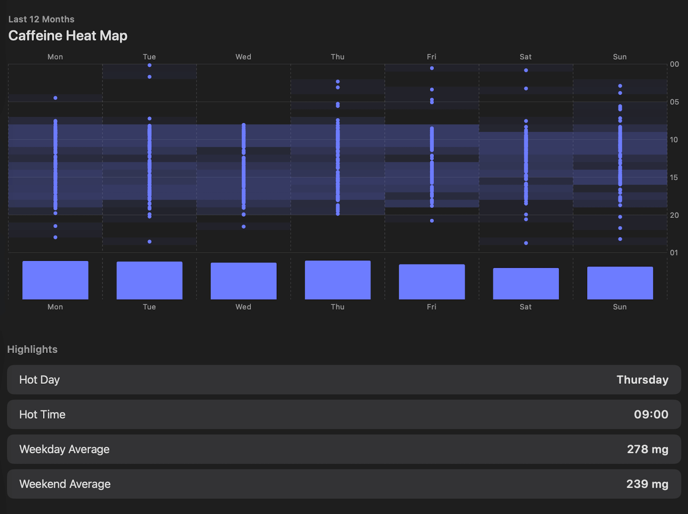
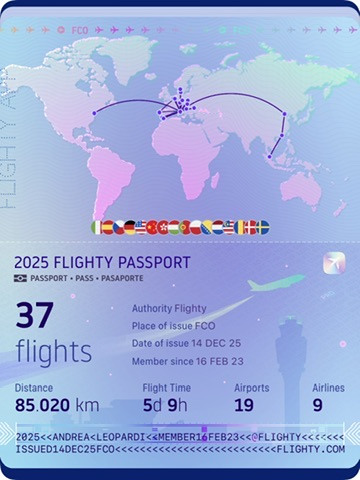
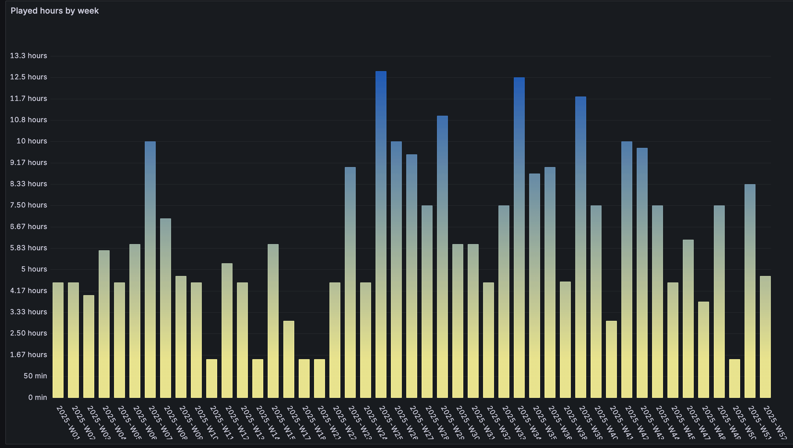
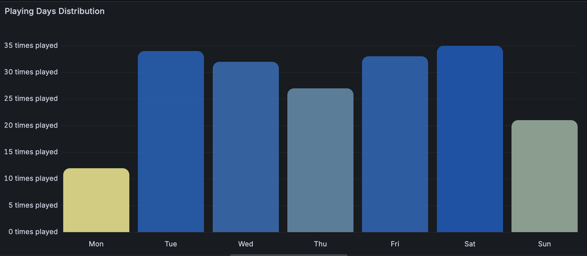

I love me some metrics about the stuff that happens in my life. I believe the kids call this **quantified self** (based off of [/r/QuantifiedSelf](https://www.reddit.com/r/QuantifiedSelf/)).

Not quite sure if this will be interesting for others to read, but I'm a fan and it'll be interesting even just for me to go back to this in the future.

<!-- more -->

{{ unsplash_credit(name="Maxim Berg", link="<https://unsplash.com/photos/a-field-of-colorful-trees-in-the-middle-of-a-forest-24j8h-9ME8o>") }}

## Nutrition

I love coffee and mostly drink pour over at home. In 2025, I drank average of 255 mg of caffeine each day for a total of 92 g of caffeine over the year. I drink pretty consistently—one coffee when I wake up, and one coffee after lunchtime:

Courtesy of [HiCoffee](https://apps.apple.com/us/app/hicoffee-caffeine-tracker/id1507361706).

I don't really track any other nutrition-related data, like calorie intake or anything like that. That tends to lead me to disordered eating pretty fast.

## Travel

I was on 37 flights this year. That's very aligned with the previous year—I took 36 flights in 2024. Tripsy thinks I took 36 flights this year too but I don't have the patience to figure out which one's right. Anyway, I visited 17 countries in total as well.

  
  

I had already been to most of those countries before 2025. I've added these to the list:

  * Bosnia & Herzegovina 🇧🇦
  * Hong Kong 🇭🇰
  * Macau 🇲🇴
  * Malaysia 🇲🇾

## Sports

I'm into padel, as I've been for the past few years now. I've played 294 hours of padel in 2025, with some spikes (good weather) and some dips (trips and whatnot).

This surprised me: for some reason I'm quite less likely to play on *Mondays*. I expected Sundays, but Mondays are up there. I don't know why.

## Health

There's a lot of data here but maybe not that much that I'm actually interested in. One I liked is the average sleep time: pretty proud of my almost-8-hour average over the past six months.

The skewed one is a trip to South East Asia!

I could plot this in Grafana and look at it over the past year but that would take me longer than I want to put into this.

## Conclusion

This is the first time I'm doing this and it was pretty fun. It's not a lot of data, but to be honest I have a lot more—it's just a lot of work to make sense of it 🙃.
